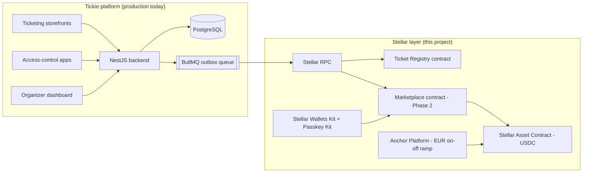
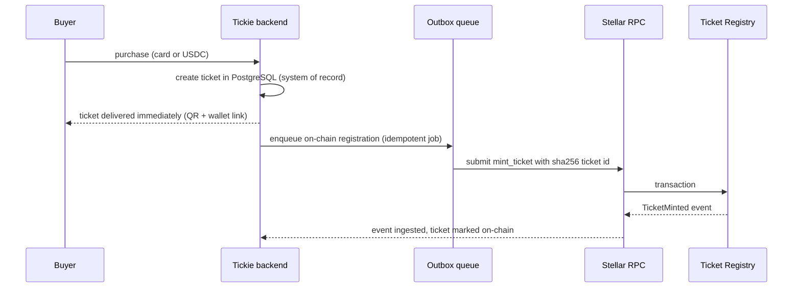

# Technical Architecture — Tickie × Stellar

This document describes the technical architecture of the Stellar settlement and ownership layer Tickie is building on top of its existing B2B event platform. It covers the three delivery phases, the Soroban contract interfaces, the data flows between the existing backend and the chain, failure handling, and the compliance model.

## 1. Context: what already exists

Tickie operates a production SaaS platform (ticketing, CRM, seating, access control, organizer dashboards) serving 70+ professional event organizers, with 500,000+ tickets delivered. The platform runs a NestJS/PostgreSQL backend with an event-driven job pipeline (BullMQ/Redis).

**Design principle: the Stellar layer is additive.** The existing sales funnel, seating engine and organizer tools are unchanged. The chain becomes the settlement and ownership layer underneath them. Organizers and fans never need crypto knowledge; ticket sales are never blocked by chain availability (see §6).



## 2. Phased delivery (~6 months)

| Phase | Months | Deliverable |
|---|---|---|
| 1. Ticket Registry | M1–M2 | `ticket-registry` contract (this repo), backend integration, duplicate-proof issuance, atomic check-in |
| 2. Marketplace | M3–M4 | `marketplace` contract: compliant resale, atomic royalty splits in USDC, per-event resale policy enforcement |
| 3. Settlement & onboarding | M5–M6 | Anchor Platform integration (EUR↔USDC), Passkey Kit wallet onboarding, mainnet rollout to first organizers |

## 3. Stellar components used (SCF Integration List)

| Component | Role in the architecture |
|---|---|
| **Soroban** | The two custom contracts (`ticket-registry`, `marketplace`) |
| **Stellar RPC** | Transaction submission + event ingestion (registry/marketplace events indexed back into PostgreSQL) |
| **Stellar Asset Contract (USDC)** | Settlement leg of resales and payouts |
| **Anchor Platform** | Fiat EUR ↔ USDC on/off ramp for international sales and organizer payouts. Primary anchor candidate: **Mykobo** (EU-regulated, EURC/SEP-24); integration conversations planned during Phase 2; the Anchor Platform keeps the design anchor-agnostic |
| **Stellar Wallets Kit** | Wallet connection for crypto-native buyers on the resale market |
| **Passkey Kit** | Face ID / Touch ID smart-wallet onboarding for mainstream buyers (no seed phrase, ever) |
| **Launchtube** | Fee-sponsored transaction submission so buyers never need to hold XLM |

## 4. Contract interfaces

### 4.1 Ticket Registry (Phase 1, implemented in this repo)

Status: **implemented, tested (13 unit tests, CI) and live on testnet**, source-verified on StellarExpert: contract [`CBHK6M5PHUS7MAAMUWDC6V3E6BSX2OU65QKVMH5OVE4DJ4AGO57SPWMO`](https://stellar.expert/explorer/testnet/contract/CBHK6M5PHUS7MAAMUWDC6V3E6BSX2OU65QKVMH5OVE4DJ4AGO57SPWMO), full lifecycle (mint → transfer → check-in, plus duplicate-mint and double-check-in rejections) exercised on-chain.

Storage model:

```rust
enum DataKey {
    Admin,                    // instance: platform admin address
    Event(u64),               // persistent: event_id -> EventInfo
    Ticket(BytesN<32>),       // persistent: ticket_id -> Ticket
}

struct EventInfo {
    organizer: Address,       // royalty recipient
    royalty_bps: u32,         // resale royalty (e.g. 500 = 5%)
    resale_cap_bps: u32,      // max resale price vs face value (10_000 = face value)
    metadata_uri: String,     // off-chain metadata, no PII
}

struct Ticket {
    event_id: u64,
    owner: Address,
    seat: String,             // "" for general admission
    face_value: i128,         // USDC minor units (7 decimals)
    valid_from: u64,          // unix seconds
    valid_until: u64,
    status: TicketStatus,     // Valid | CheckedIn | Revoked
}
```

Entry points:

| Function | Auth | Purpose |
|---|---|---|
| `__constructor(admin)` | deploy | Set platform admin |
| `create_event(event_id, organizer, royalty_bps, resale_cap_bps, metadata_uri)` | admin | Register event + resale policy |
| `mint_ticket(ticket_id, event_id, owner, seat, face_value, valid_from, valid_until)` | admin | Register a sold ticket; duplicate ids rejected |
| `transfer(ticket_id, to)` | ticket owner | P2P ownership transfer |
| `check_in(ticket_id)` | admin | Consume ticket at the gate, exactly once |
| `revoke(ticket_id)` | admin | Cancellation / refund |
| `get_ticket` / `get_event` / `owner_of` / `is_valid` | none | Read APIs for backend + gate devices |

Design notes:

- `ticket_id = SHA-256(internal Tickie ticket reference)`: deterministic, collision-proof, idempotent registration, and **no personal data on-chain** (GDPR-safe: holders are Stellar addresses, everything nominative stays in the existing PostgreSQL, which remains the system of record for identity).
- Contract events (`event`, `mint`, `transfer`, `checkin`, `revoke`) are ingested via Stellar RPC into the backend for reporting and reconciliation.
- Persistent entries get their TTL extended (~120 days) on every touch; a background job re-bumps long-lived inventory.

### 4.2 Marketplace (Phase 2, interface design)

```rust
// All amounts settle in USDC via the Stellar Asset Contract.
fn list(ticket_id: BytesN<32>, price: i128)              // owner auth; price <= face_value * resale_cap_bps
fn delist(ticket_id: BytesN<32>)                          // seller auth
fn buy(ticket_id: BytesN<32>, buyer: Address)             // buyer auth; atomic settlement:
    // 1. verify listing + resale policy (cap, window) from the registry
    // 2. USDC transfer buyer -> {seller, organizer royalty, platform fee} in one transaction
    // 3. registry.transfer(ticket_id, buyer) in the same transaction
fn set_fee(fee_bps: u32)                                  // admin
```

The royalty split is **atomic**: seller proceeds, organizer royalty and platform fee move in the same Soroban transaction as the ownership transfer. There is no escrow state to reconcile and no partial-failure window.

Design note: royalty distribution is deliberately *not* a separate contract. Splitting it out (a "royalty contract" called after settlement) would reintroduce exactly the partial-failure window the atomic design eliminates; instead the split is a leg of `buy` itself, reading the policy anchored in the registry's `EventInfo`.

### 4.3 Settlement (Phase 3)

- Organizer payouts: USDC → EUR via Anchor Platform (SEP-24/SEP-31 flows), replacing multi-day card-rail payouts.
- International buyers: local currency → USDC via the anchor; crypto-native buyers may bridge in via Allbridge as a secondary path.
- Buyer onboarding: Passkey Kit smart wallets created invisibly at checkout; Launchtube sponsors fees so buyers hold zero XLM.

## 5. Backend ↔ chain data flow

Ticket purchase (primary sale):



Gate check-in follows the same pattern: the access-control device validates against the backend cache instantly, and the `check_in` transaction confirms on-chain within ~5 seconds; any mismatch surfaces in reconciliation before the ticket can be reused.

## 6. Failure handling

| Failure | Behavior |
|---|---|
| Stellar RPC unavailable during a sale | Sales are **never blocked**: tickets are issued off-chain first; on-chain registration is an idempotent outbox job that retries with backoff until confirmed |
| Duplicate registration attempt (job retry, race) | Rejected by the contract (`TicketAlreadyExists`); the outbox treats it as success (idempotence) |
| Transaction fee spike / surge pricing | Fee-bump via Launchtube; jobs are re-submitted with adjusted resources |
| Backend ↔ chain divergence | Nightly reconciliation job diffs PostgreSQL against RPC-ingested contract events; divergences are alerted, never silently corrected |
| Gate offline (venue connectivity) | Devices hold a signed local snapshot; check-ins are queued and settled on-chain when connectivity returns; double-entry attempts are caught by the atomic `check_in` |

## 7. Compliance

- **French resale law**: ticket resale in France is regulated (unauthorized for-profit resale is prohibited, Code pénal art. 313-6-2). The marketplace contract makes the organizer's resale policy (price cap, transfer window) *structurally enforceable on-chain*, which is stronger than the off-chain moderation used by incumbents. This turns a legal constraint into a product feature.
- **ControlTick**: Tickie is ControlTick-certified (French ticketing compliance label); the on-chain registry strengthens the auditability this label requires.
- **GDPR**: no personal data on-chain (see §4.1). Right-to-erasure applies to the off-chain PostgreSQL record; the on-chain hash is not linkable to a person without it.
- **Funds flow**: fiat flows are handled by the regulated anchor (KYC at the ramp), not by Tickie contracts.

## 8. Security posture

- Contracts kept deliberately small and auditable; no upgradeability magic: admin key rotation via `set_admin`, contract upgrades via standard Wasm upgrade with a timelocked admin (Phase 2).
- `overflow-checks = true` in release; all state transitions are explicit finite-state (Valid → CheckedIn | Revoked, terminal).
- Audit planned through the Stellar LaunchKit audit credits at the testnet tranche (per SCF Build framework).
