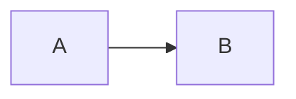
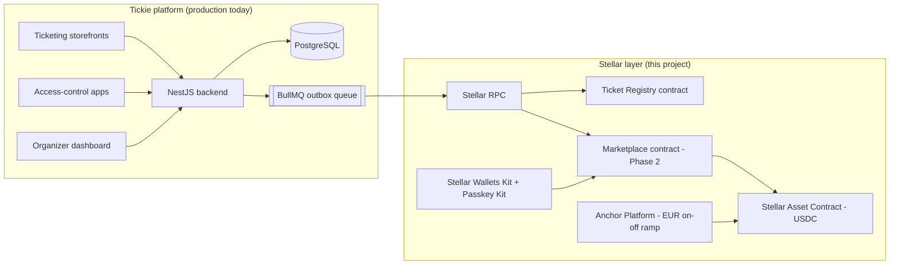
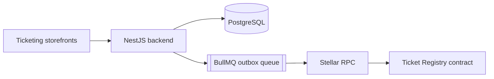
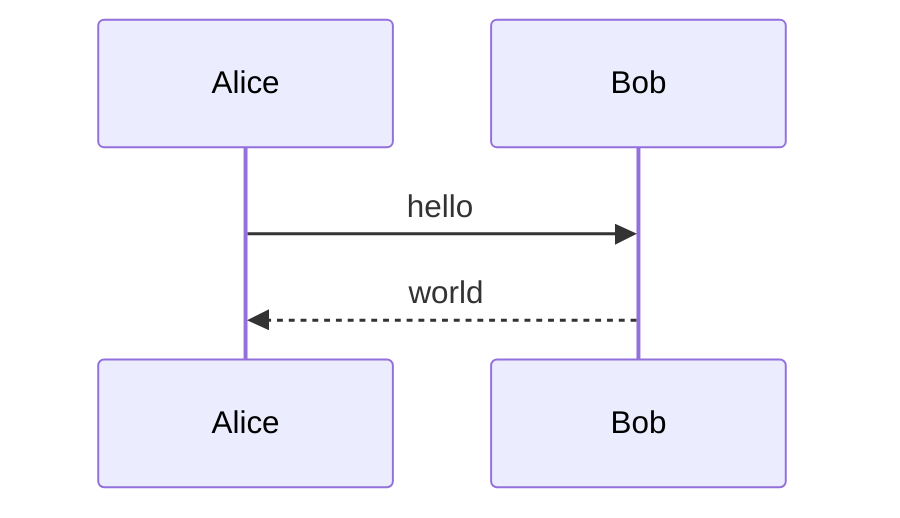
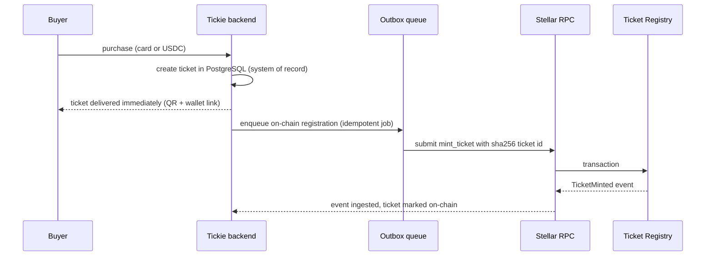

# Mermaid render bisection (temporary)

## A. Minimal flowchart

## B. Full flowchart (current ARCHITECTURE version)

## C. Flowchart no subgraph, no indentation

## D. Minimal sequence

## E. Full sequence (current ARCHITECTURE version)

